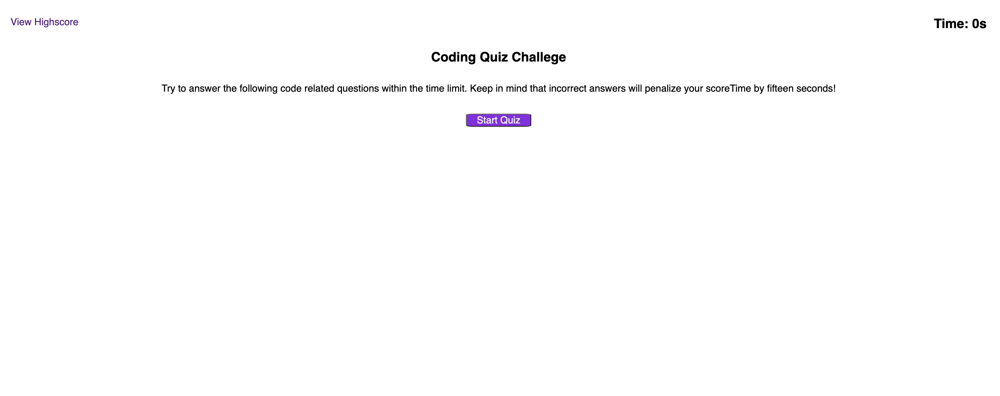
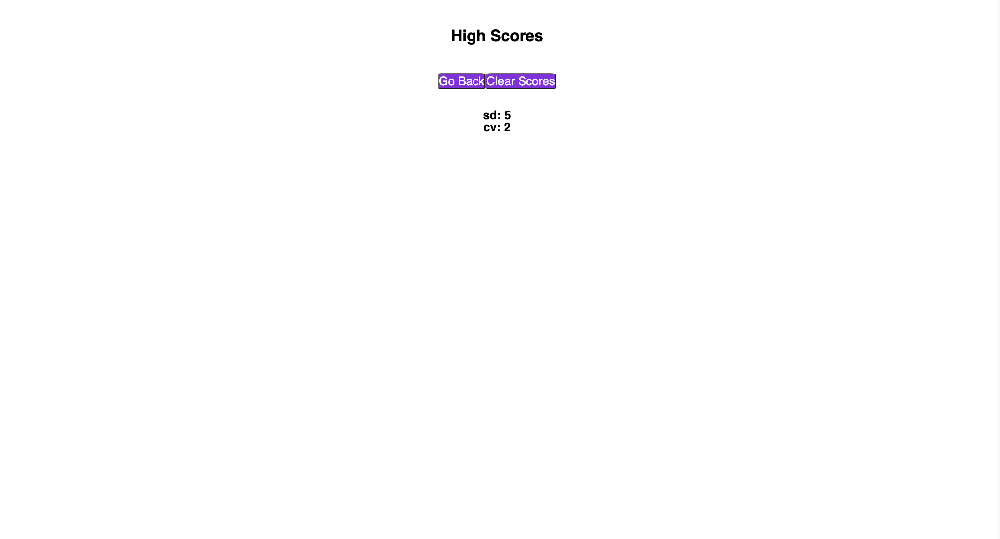

# Code-Quiz

## Description:
This was a scenerio to develop a coding assesment quiz mock quiz as part of an interview process to further improve the knowledge. This applicaiton is timed quiz with multiple choices stores and sorts users highest scores in local storage. This was the most challenging development experince thus far and will continue to improve to achieve clean, polished, and responsive user interface. 

## Table of Contents

- [Usage](#usage)
- [Credits](#credits)
- [License](#license)
- [Mock-up](#mock-up)

## Usage
- Github page (https://github.com/mjtic/module4-codequiz/)
- URL (https://mjtic.github.io/module4-codequiz/)

  

## Credits

## License

Please refer to the LICENSE in the repo.

## Mock-up##
